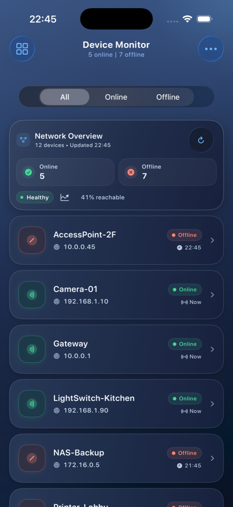

# DeviceMonitor


An iOS prototype for monitoring network devices with a clear online/offline overview, status history, filtering, and search.

## Screenshot



## Features

- Dark-first device dashboard with a refined blue-black gradient theme
- Sticky status filter with native iOS 26 segmented picker behavior
- Network Overview summary card with live refresh control
- Integrated top search panel for device name and IPv4 filtering
- Full-screen add, overview, and detail modals with shared modal components
- Device detail view with metadata and status history
- Swipe-to-remove list rows during the current app session
- Toolbar action menu for add, search focus, and manual refresh
- Mock monitor service with stable device identities and simulated status changes

## Architecture

```
DeviceMonitor/
  App/
    DeviceMonitorApp.swift
  Models/
    Device.swift
  Services/
    ServiceContracts.swift
    MockDeviceMonitor.swift
    LocalStorageService.swift
  ViewModels/
    DevicesViewModel.swift
  Views/
    ContentView.swift
    AppTheme.swift
    Devices/
      DevicesView.swift
      DevicesToolbarViews.swift
      DevicesFilterViews.swift
      DevicesContentViews.swift
      DeviceRowViews.swift
      AddAndSearchDeviceViews.swift
      DeviceModalSharedViews.swift
      DeviceOverviewAndDetailViews.swift
  Utilities/
    IPv4Validator.swift
```

- **SwiftUI** for the view layer
- **SwiftData** for persistence
- **Swift 6 strict concurrency** (`async/await`, `actor`, `@MainActor`)
- **MVVM** with separated service/storage/view-model boundaries

## Build and Run

1. Open `DeviceMonitor.xcodeproj` in Xcode.
2. Select the `DeviceMonitor` scheme.
3. Run on an iPhone simulator.

### CLI build example

```bash
xcodebuild -project DeviceMonitor.xcodeproj \
  -scheme DeviceMonitor \
  -destination 'platform=iOS Simulator,name=iPhone 17' \
  build-for-testing
```

## Tests

- Unit tests: `DeviceMonitorTests`
- UI tests: `DeviceMonitorUITests`

## Notes

- The app intentionally uses mock/local data only and is aimed at demo/prototype scenarios rather than production networking.
- Previews use an in-memory SwiftData container so they stay isolated from the running app store.
- Liquid Glass is used on controls where it fits best, while scrolling content cards remain standard surfaces for readability and performance.
- The devices feature stays in one focused folder so routing, shared list UI, and modal flows remain easy to follow.
